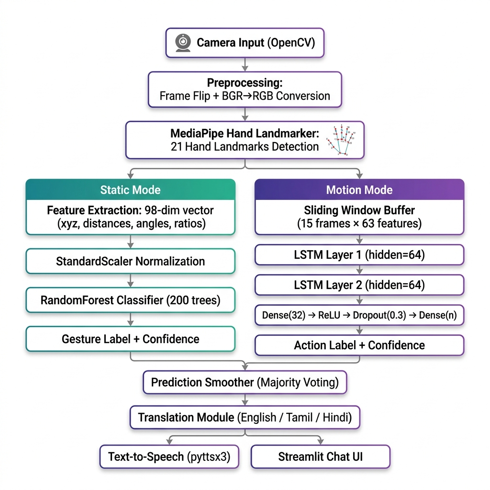
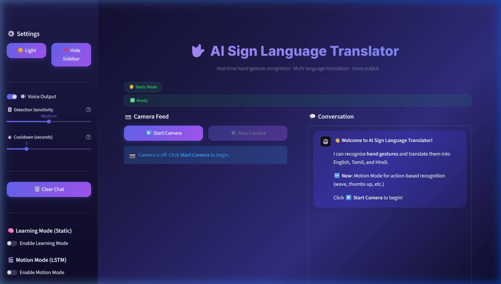

# Deep Learning Neural Network Models
## AI Sign Language Translator Using LSTM & RandomForest

**Subject:** Deep Learning Neural Network Models  
**Project Title:** AI Sign Language Translator  
**Technology Stack:** Python, Streamlit, MediaPipe, OpenCV, scikit-learn, PyTorch  
**Team Members:** _______________  
**Date:** May 2026  

---

## 1. Aim

To design and develop a **real-time AI-powered Sign Language Translator** that uses deep learning neural network models to recognize hand gestures from a live webcam feed and translate them into text in multiple languages (English, Tamil, Hindi) with voice output support.

---

## 2. Objective

1. **Build a real-time hand gesture recognition system** using MediaPipe's Hand Landmarker to detect and extract 21 hand landmarks from live camera frames.
2. **Implement a Static Gesture Classification model** using RandomForest with rich feature engineering (98 features including normalized coordinates, distances, angles, and extension ratios) for single-frame gesture recognition.
3. **Implement a Motion-based Action Recognition model** using a stacked LSTM (Long Short-Term Memory) deep learning network for temporal sequence classification of 15-frame gesture sequences.
4. **Enable user-trainable gesture learning** where users can record new gestures and train the model in real-time via the Learning Mode interface.
5. **Provide multi-language translation** of recognized gestures into English, Tamil, and Hindi using an offline dictionary-based approach.
6. **Integrate Text-to-Speech output** using pyttsx3 for audible gesture translation.
7. **Deploy a user-friendly web interface** using Streamlit with a modern glassmorphism UI design featuring dark/light themes.

---

## 3. Architecture Diagram



### System Architecture (Text Representation)

```
┌─────────────────────────────────────────────────────────────────────┐
│                        INPUT LAYER                                  │
│                   Camera (OpenCV VideoCapture)                       │
│                    Live Video Frames (BGR)                           │
└───────────────────────────┬─────────────────────────────────────────┘
                            ▼
┌─────────────────────────────────────────────────────────────────────┐
│                     PREPROCESSING LAYER                             │
│  1. cv2.flip(frame, 1) → Mirror image for selfie view              │
│  2. cv2.cvtColor(BGR → RGB) → Color space conversion               │
│  3. MediaPipe Hand Landmarker → 21 landmarks (x, y, z)             │
│     - Detection Confidence: 0.7                                    │
│     - Model: hand_landmarker.task (Float16)                         │
└───────────────────────────┬─────────────────────────────────────────┘
                            ▼
              ┌─────────────┴──────────────┐
              ▼                            ▼
┌──────────────────────┐     ┌──────────────────────────┐
│    STATIC MODE       │     │     MOTION MODE           │
│   (RandomForest)     │     │     (LSTM Network)        │
│                      │     │                            │
│ Feature Extraction:  │     │ Input: 15 frames × 63     │
│  98-dim vector       │     │ features per frame         │
│  • 63 norm xyz       │     │                            │
│  • 5 tip-wrist dist  │     │ Sliding Window Buffer      │
│  • 5 tip-palm dist   │     │ (slide_step = 3)           │
│  • 5 PIP angles      │     │                            │
│  • 5 MCP angles      │     │ ┌──────────────────────┐   │
│  • 10 inter-tip dist │     │ │ LSTM Layer 1 (64)    │   │
│  • 5 ext ratios      │     │ │ LSTM Layer 2 (64)    │   │
│                      │     │ │ Dense(32) + ReLU     │   │
│ StandardScaler       │     │ │ Dropout(0.3)         │   │
│ RandomForest (200    │     │ │ Dense(n_classes)     │   │
│   trees)             │     │ └──────────────────────┘   │
│ Data Augmentation    │     │                            │
│   (Gaussian noise)   │     │ Optimizer: Adam (lr=1e-3)  │
│                      │     │ Loss: CrossEntropyLoss     │
│ Confidence ≥ 0.40    │     │ Early Stopping (patience=15│)
└──────────┬───────────┘     └─────────────┬──────────────┘
           ▼                               ▼
┌─────────────────────────────────────────────────────────────────────┐
│                    POST-PROCESSING LAYER                            │
│  PredictionSmoother — Sliding window majority voting (window=7)     │
│  Confidence threshold filtering (≥ 40%)                             │
│  Cooldown timer to prevent repeated detections                      │
└───────────────────────────┬─────────────────────────────────────────┘
                            ▼
┌─────────────────────────────────────────────────────────────────────┐
│                       OUTPUT LAYER                                  │
│  1. Gesture Label → Translation (English / Tamil / Hindi)           │
│  2. Text-to-Speech (pyttsx3, background thread)                     │
│  3. Streamlit Chat UI with glassmorphism design                     │
└─────────────────────────────────────────────────────────────────────┘
```

---

## 4. Dataset Description

### 4.1 Static Mode Dataset (`gesture_data.csv`)

| Property | Details |
|---|---|
| **Format** | CSV (Comma Separated Values) |
| **Features per sample** | 98 features |
| **Feature Breakdown** | 63 normalized xyz + 5 tip-wrist distances + 5 tip-palm distances + 5 PIP angles + 5 MCP angles + 10 inter-tip distances + 5 extension ratios |
| **Labels** | User-defined gesture names (e.g., Hello, Yes, No, Thank You, Stop) |
| **Collection Method** | Real-time recording via Learning Mode — user shows gesture to camera |
| **Augmentation** | 2× Gaussian noise augmentation (σ = 0.005) during training |
| **Normalization** | Wrist-relative coordinates (landmark positions minus wrist position) |

**Feature Engineering Details:**

1. **Normalized XYZ (63 features):** Each of the 21 landmarks' x, y, z coordinates normalized relative to the wrist landmark (landmark 0), making the features position-invariant.
2. **Tip-to-Wrist Distances (5 features):** Euclidean distance from each fingertip to the wrist — captures how far each finger extends.
3. **Tip-to-Palm Distances (5 features):** Distance from fingertips to the palm center (average of wrist + 5 MCP joints).
4. **PIP Joint Curl Angles (5 features):** Angle at each finger's PIP joint (MCP→PIP→TIP) — measures finger curl.
5. **MCP Joint Angles (5 features):** Angle at MCP joints — captures finger spread.
6. **Inter-Fingertip Distances (10 features):** All C(5,2)=10 pairwise distances between fingertips.
7. **Extension Ratios (5 features):** Ratio of tip-to-wrist distance over MCP-to-wrist distance for each finger.

### 4.2 Motion Mode Dataset (`dataset/` folder)

| Property | Details |
|---|---|
| **Format** | NumPy `.npy` binary files |
| **Structure** | `dataset/<action_name>/sequence_N.npy` |
| **Shape per file** | `(15, 63)` — 15 frames × 63 features |
| **Features per frame** | 63 (21 landmarks × 3 xyz, wrist-normalized) |
| **Sequence Length** | 15 frames (~0.5 seconds at 30 FPS) |
| **Labels** | Folder names = action names |
| **Collection Method** | Real-time recording via Motion Mode — user performs action while camera records frame-by-frame |

---

## 5. Methodology & Algorithm

```
INPUT:  Live camera video frames
OUTPUT: Translated gesture text + voice output

Step 1: CAPTURE frame from webcam using OpenCV

Step 2: PREPROCESS
        - Flip frame horizontally (mirror view)
        - Convert BGR → RGB color space

Step 3: DETECT HAND using MediaPipe Hand Landmarker
        - Extract 21 hand landmark points (x, y, z coordinates)
        - If no hand detected → go to Step 1

Step 4: CLASSIFY gesture (either Static or Motion mode)

        [Static Mode — RandomForest]
        a. Extract 98-dim feature vector (normalized xyz, distances, angles, ratios)
        b. Normalize using StandardScaler
        c. Predict using RandomForest (200 trees) → gesture label + confidence

        [Motion Mode — LSTM Deep Learning]
        a. Buffer 15 consecutive frames (sliding window)
        b. Pass sequence (15×63) through stacked LSTM network
           LSTM(64) → LSTM(64) → Dense(32) → ReLU → Dropout → Dense(n_classes)
        c. Apply softmax → action label + confidence

Step 5: SMOOTH prediction using majority voting (window size = 7)
        - Reject if confidence < 40%

Step 6: TRANSLATE recognized gesture to English / Tamil / Hindi

Step 7: OUTPUT
        - Display in Streamlit chat UI
        - Speak via Text-to-Speech (pyttsx3)

Step 8: REPEAT from Step 1
```

---

## 6. Source Code

### 6.1 LSTM Model Definition (`motion_model.py`)

```python
class ActionLSTM(nn.Module):
    def __init__(self, n_features: int, n_classes: int):
        super().__init__()
        self.lstm1 = nn.LSTM(n_features, 64, batch_first=True)
        self.lstm2 = nn.LSTM(64, 64, batch_first=True)
        self.classifier = nn.Sequential(
            nn.Linear(64, 32), nn.ReLU(),
            nn.Dropout(0.3), nn.Linear(32, n_classes),
        )

    def forward(self, x):
        x, _ = self.lstm1(x)       # (batch, 15, 64)
        x, _ = self.lstm2(x)       # (batch, 15, 64)
        x = x[:, -1, :]            # Last timestep → (batch, 64)
        x = self.classifier(x)     # (batch, n_classes)
        return x
```

### 6.2 Feature Engineering (`learning_mode.py`)

```python
def landmarks_to_features(landmarks):
    """Convert 21 hand landmarks → 98-dimensional feature vector."""
    base_x, base_y, base_z = landmarks[0].x, landmarks[0].y, landmarks[0].z

    norm_xyz = []  # 63 features: wrist-relative coordinates
    for lm in landmarks:
        norm_xyz.extend([lm.x - base_x, lm.y - base_y, lm.z - base_z])

    tip_wrist_dists = [_dist(landmarks[t], landmarks[WRIST]) for t in FINGER_TIPS]  # 5
    tip_palm_dists = [_dist(landmarks[t], palm) for t in FINGER_TIPS]               # 5
    pip_angles = [_angle(landmarks[a], landmarks[b], landmarks[c])                  # 5
                  for a, b, c in finger_chains]
    mcp_angles = [_angle(landmarks[a], landmarks[b], landmarks[c])                  # 5
                  for a, b, c in mcp_chains]
    inter_tip_dists = [_dist(landmarks[FINGER_TIPS[i]], landmarks[FINGER_TIPS[j]])  # 10
                       for i in range(5) for j in range(i+1, 5)]
    ext_ratios = [tip_dist / mcp_dist for tip, mcp in zip(FINGER_TIPS, FINGER_MCPS)]  # 5

    return norm_xyz + tip_wrist_dists + tip_palm_dists + pip_angles + \
           mcp_angles + inter_tip_dists + ext_ratios   # Total: 98
```

### 6.3 Hand Detection (`gesture_detector.py`)

```python
class GestureDetector:
    GESTURES = {
        "Hello":     [1, 1, 1, 1, 1],   # All fingers open
        "Yes":       [1, 0, 0, 0, 0],   # Thumb up
        "No":        [0, 1, 0, 0, 0],   # Index finger only
        "Thank You": [1, 0, 0, 0, 1],   # Thumb + pinky
        "Stop":      [0, 0, 0, 0, 0],   # Closed fist
    }

    def __init__(self, max_hands=1, detection_confidence=0.7):
        options = HandLandmarkerOptions(
            base_options=BaseOptions(model_asset_path=_MODEL_PATH),
            running_mode=RunningMode.IMAGE,
            num_hands=max_hands,
            min_hand_detection_confidence=detection_confidence,
        )
        self.landmarker = HandLandmarker.create_from_options(options)

    def process_frame(self, frame):
        frame = cv2.flip(frame, 1)
        rgb = cv2.cvtColor(frame, cv2.COLOR_BGR2RGB)
        result = self.landmarker.detect(mp.Image(image_format=mp.ImageFormat.SRGB, data=rgb))
        # Match finger states against known gesture patterns
        return frame, gesture
```

### 6.4 RandomForest Training (`learning_mode.py`)

```python
def train_model():
    X, y = load_dataset()
    X_aug, y_aug = _augment_data(X, y, factor=2, noise_level=0.005)
    scaler = StandardScaler()
    X_scaled = scaler.fit_transform(X_aug)

    clf = RandomForestClassifier(
        n_estimators=200, max_depth=25,
        class_weight="balanced", n_jobs=-1,
    )
    clf.fit(X_scaled, y_aug)
    joblib.dump(clf, MODEL_PATH)
    joblib.dump(scaler, SCALER_PATH)
```

### 6.5 Translation & Voice Output

```python
# translator.py
TRANSLATIONS = {
    "Hello": {"en": "Hello", "ta": "வணக்கம்", "hi": "नमस्ते"},
    "Yes":   {"en": "Yes",   "ta": "ஆம்",     "hi": "हाँ"},
    "No":    {"en": "No",    "ta": "இல்லை",   "hi": "नहीं"},
}

# voice_output.py — Background thread TTS
def speak(text, rate=150, volume=0.9):
    def _worker():
        engine = pyttsx3.init()
        engine.say(text)
        engine.runAndWait()
    threading.Thread(target=_worker, daemon=True).start()
```

### 6.6 Dependencies

```
streamlit, numpy, opencv-python-headless, mediapipe,
scikit-learn, joblib, pandas, pyttsx3, torch (CPU)
```

---

## 7. Output

### 7.1 Application Interface



**Features visible in the output:**
- **Sidebar:** Settings panel with Voice Output toggle, Detection Sensitivity slider, Cooldown timer
- **Main Area:** Camera Feed section with Start/Stop buttons, Conversation chat panel
- **Modes:** Learning Mode (Static — RandomForest) and Motion Mode (LSTM) toggles
- **UI Design:** Dark theme with glassmorphism, gradient title, purple accent colors

### 7.2 Sample Output Flow

```
1. User shows open palm → Camera captures frame
2. MediaPipe detects 21 hand landmarks
3. System extracts finger states: [1, 1, 1, 1, 1]
4. Matches gesture → "Hello" (confidence: 92%)
5. Chat displays:
   ┌─────────────────────────────────────────┐
   │ ✋ Hello                                │
   │ 🇬🇧 English: Hello                     │
   │ 🇮🇳 Tamil: வணக்கம்                      │
   │ 🇮🇳 Hindi: नमस्ते                       │
   └─────────────────────────────────────────┘
6. Voice output speaks: "Hello"
```

### 7.3 How to Run

```bash
pip install -r requirements.txt
streamlit run app.py
# Opens at http://localhost:8501
```

### 7.4 Model Performance

| Model | Type | Accuracy | Speed |
|---|---|---|---|
| RandomForest (Static) | ML Ensemble | ~85-95% | ~5ms/frame |
| LSTM (Motion) | Deep Learning RNN | ~80-95% | ~10ms/sequence |
| Rule-Based (Baseline) | Heuristic | 100% (5 gestures) | ~1ms/frame |

---

## 8. Conclusion

This project demonstrates **Deep Learning Neural Network models** for real-time sign language translation. The dual-model architecture — RandomForest for static gestures and LSTM for temporal action recognition — provides a robust system extensible through the Learning Mode interface.

**Key Achievements:**
- Real-time inference at 30+ FPS using MediaPipe
- Rich 98-dimensional feature engineering
- Lightweight LSTM (~50K params) for CPU inference
- Data augmentation and temporal smoothing
- Multi-language support with offline translation and TTS

---

*Document prepared for academic submission — AI Sign Language Translator Project*
